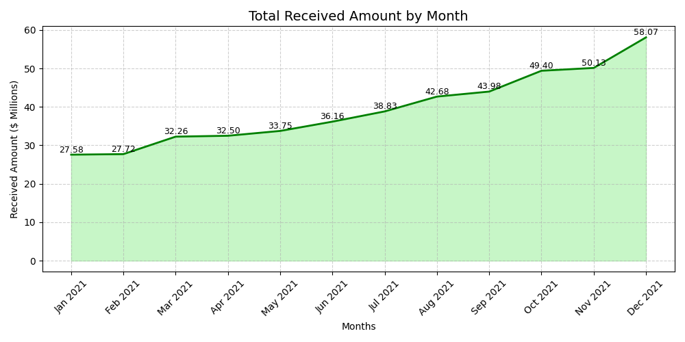
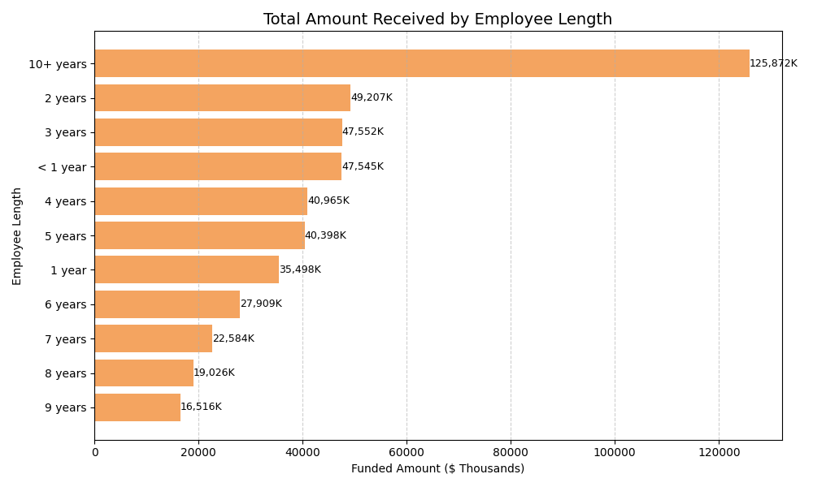
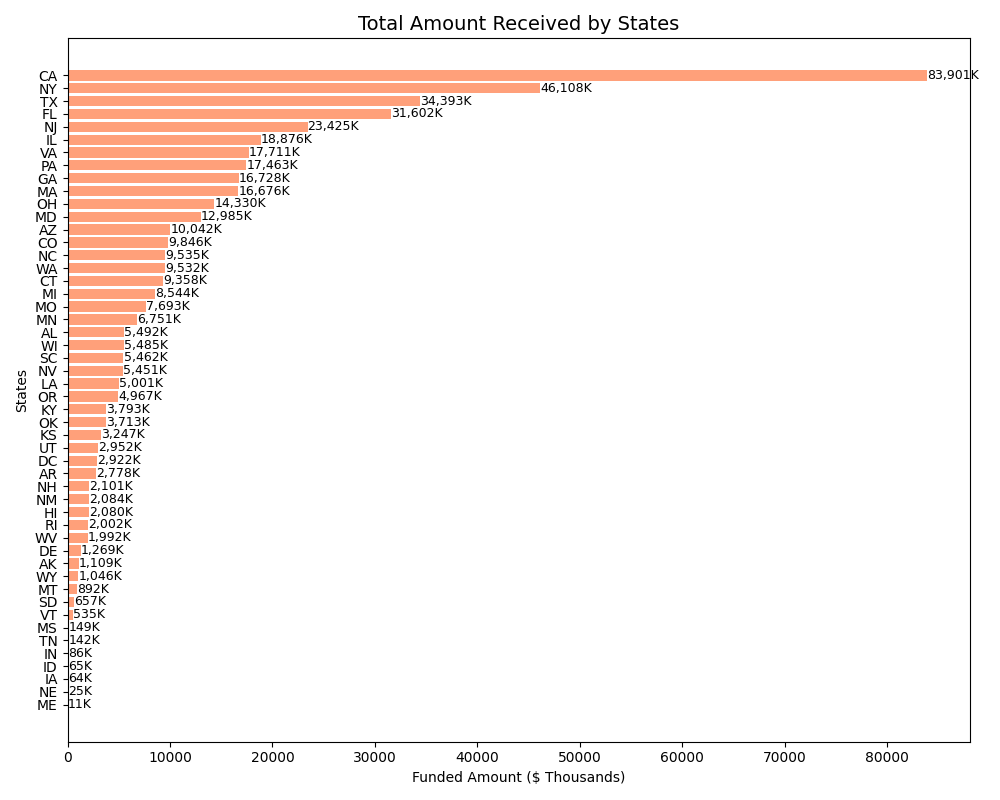

# 🏦 Bank Loan Analysis (Data Analytics Python Project)

A comprehensive **loan portfolio analysis project** to identify **profitable segments, high-risk borrowers, and strategic insights** for a bank’s lending business.  
This project explores borrower behavior, financial performance, and risk exposure using **Python**, **Jupyter Notebook**, and **data visualization** — helping the bank make **data-driven lending decisions** and **minimize portfolio losses**.

      

---

## 📊 Project Overview

This project aims to analyze a bank’s loan data to:
- Understand **loan performance** and **profitability trends**
- Identify **risk concentrations** in customers, products, and regions
- Discover the **most reliable borrower segments**
- Provide **strategic recommendations** to optimize profit and reduce losses

---

## 🧩 Key Business Questions

1. What percentage of loans are **good (fully paid)** vs **bad (charged off)**?  
2. Which **loan purposes** and **terms** are most popular and profitable?  
3. How does **employment length** affect funding and repayment behavior?  
4. Which **home ownership** groups are most financially stable?  
5. Which **states or regions** contribute most to profit and risk?  
6. What strategic actions can reduce overall loan losses?

---

## 🛠️ Tools & Technologies Used

| Tool | Purpose |
|------|----------|
| **Python (Pandas, Matplotlib, Seaborn)** | Data cleaning, transformation, and visualization |
| **Jupyter Notebook** | Exploratory data analysis and reporting |
| **Power BI** | Interactive dashboard creation and storytelling |
| **Excel / CSV** | Raw data input and initial inspection |
| **SQL** | Data querying and aggregation for analysis |

---

## 📈 Major Insights by Analysis

### 💰 1. Financial Snapshot – Profitability Overview
- **Good Loans:** 86.18% of portfolio generating **$65.57M profit**  
- **Bad Loans:** 13.82% resulting in **$28.25M loss**  
- **Net Profit:** **$37.31M**, confirming overall profitability  
- ✅ *Goal:* Reduce charged-off losses to improve total returns.

---

### 🧑‍💼 2. Employment Length Analysis
- Borrowers with **10+ years** of employment are the **most stable and profitable**.  
- “Less than 1 year” employees form a **high-risk group**, though large in volume.  
- 🏁 *Conclusion:* The bank’s foundation lies in long-term, stable employees.

---

### 💳 3. Loan Purpose Analysis
- **Debt Consolidation** dominates the portfolio — highest funding, revenue, and demand.  
- However, this creates a **single point of business risk**.  
- ⚖️ *Strategy:* Diversify product offerings to reduce dependency.

---

### 🏠 4. Home Ownership Analysis
- **Mortgage holders** receive and return the most funds, confirming **asset-backed stability**.  
- **Renters** form a major risk segment by volume and need stricter underwriting.  
- 🧭 *Insight:* The bank’s financial stability relies heavily on mortgage customers.

---

### 🌍 5. Regional Performance
- **California (CA)** is the top-performing but most risk-exposed state.  
- Heavy regional dependence makes the portfolio vulnerable to local economic downturns.  
- 🌐 *Strategy:* Expand lending to states like **TX, NY, FL** for risk diversification.

---

## 🧠 Data-Driven Insights Summary

| Segment | Description | Impact |
|----------|--------------|---------|
| **Good Loans** | 86.18% of portfolio | +$65.57M profit |
| **Bad Loans** | 13.82% charged off | -$28.25M loss |
| **Top Product** | Debt Consolidation | High profit, high risk |
| **Top Borrowers** | 10+ years employed, mortgage holders | Most stable & profitable |
| **High Risk Borrowers** | Renters, <1 year employed | Require strict underwriting |
| **Top Region** | California | Profitable but risky |

---

## 📁 File Structure
```
├── Bank Loan Analysis.ipynb     # Main analysis notebook
├── Bank_loan_data.csv           # Dataset file
├── images/                      # Folder containing chart images
│ ├── Total_Amount_Received_by_Month.png
│ ├── Total_Amount_Received_by_Employee_Length.png
│ └── Total_Amount_Received_by_States.png
└── README.md                    # Project documentation
```

---

## 📸 Project Preview

Here are some sample visualizations from the analysis:

### 1️⃣ Monthly Trends by Issue Date – Total Amount Received

This chart shows how **loan repayments increased** steadily each month, reaching their highest point in **December 2021**. It highlights the bank’s strong cash flow growth and ability to scale operations with rising customer demand.


&nbsp;

### 2️⃣ Employee Length Analysis – Total Amount Received

This chart shows that borrowers with **10+ years of employment** contribute the **highest total repayments**, proving they are the most financially reliable group. It also shows that borrowers with less than **1 year of employment form a large but riskier segment**.


&nbsp;

### 3️⃣ Regional Analysis by State – Total Amount Received

This chart shows that **California (CA) generates the highest total repayments**, making it the bank’s most profitable and dominant market. However, it also reveals regional concentration risk, suggesting the need to expand in **New York (NY), Texas (TX), and Florida (FL)** for better diversification.


&nbsp;

---

## 🧾 Final Conclusion: Loan Portfolio Risk & Strategy 🎯

*The analysis confirms the bank’s loan business is in a phase of **rapid, profitable growth**, but with significant risk concentration in a few key areas.*

### Key Takeaways:
- **Profitability:** The bank earns **37.31M Dollar net profit** despite $28.25M losses.  
- **Risk Concentration:** Over-reliance on **Debt Consolidation loans** and **California market** poses serious exposure.  
- **Customer Insights:**  
  - Reliable: **10+ years employed**, **Mortgage holders**  
  - Risky: **Renters**, **<1 year employed**

### 🔑 Recommended Actions:
1. **Tighten Underwriting** for Debt Consolidation loans.  
2. **Implement Risk-Based Pricing** for Renters and short-term employees.  
3. **Diversify Markets** beyond California to reduce regional dependency.  

### ✅ Outcome:
By improving risk control and portfolio balance, the bank can **increase profits**, **reduce default losses**, and build a **sustainable, data-driven lending strategy**.

---

## 🧠 Skills Demonstrated

- Data Cleaning & Preparation  
- Exploratory Data Analysis (EDA)  
- Business Intelligence & Visualization (Power BI)  
- Statistical & Financial Analysis  
- Risk Assessment & Strategic Reporting  
- Data Storytelling & Insight Communication  

---

## 🏆 Project Impact

✅ Identified $28.25M loss drivers  
✅ Pinpointed top 3 reliable borrower segments  
✅ Defined actionable strategies to boost ROI  
✅ Built a storytelling dashboard for executive-level decisions  

---

## 🧑‍💻 Author

**👤 Harsh Belekar**  
📍 Data Analyst | Python | SQL | Power BI | Excel | Data Visualization  
📬 [LinkedIn](https://www.linkedin.com/in/harshbelekar) | 🔗[GitHub](https://github.com/Harsh-Belekar)

📧 [harshbelekar74@gmail.com](mailto:harshbelekar74@gmail.com)

---

⭐ *If you found this project helpful, feel free to star the repo and connect with me for collaboration!*
